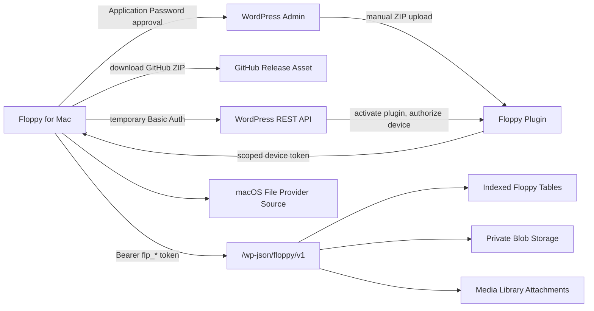

# Floppy

**Your WordPress site, reborn as a private file drive.**

Floppy is a Dropbox-like file service where the storage, metadata, permissions, sync feed, and device authorization live inside infrastructure you own: WordPress.

It is not trying to be another SaaS file silo. Floppy turns a WordPress install into a private, indexed, authenticated file system with a native macOS companion app. Files stay under your WordPress site, private by default, served through capability-checked endpoints, and synced through scoped device tokens.


## Why This Is Exciting

WordPress already solved a lot of hard problems: users, roles, admin UX, media storage, plugin distribution, hosting portability, REST APIs, extensibility, and decades of operational muscle. Floppy asks a simple question:

**What if the personal cloud was just another thing your WordPress site could own?**

That makes Floppy different:

- **Own your storage**: files live in your WordPress-controlled infrastructure, not a black-box sync vendor.
- **Private by default**: blobs are stored behind direct-access protection and served only through authenticated REST endpoints.
- **Portable by design**: export tooling is part of the plan, so your files and metadata are not trapped.
- **WordPress-native permissions**: users, roles, shares, capabilities, audit logs, and admin diagnostics fit into a familiar system.
- **Desktop-native ambition**: the macOS app is designed around Finder sync through File Provider APIs, not a web-only file browser.
- **Desktop Mode ready**: the plugin registers a native Desktop Mode window, launcher, commands, file opener, notifications, badges, and drag/drop UI.
- **Built for scale from the start**: Floppy uses custom indexed tables for file-system metadata instead of forcing huge folder queries through Media Library attachment tables.

Floppy is the old-web idea of ownership, dressed up with modern sync semantics.

## Repository Contents

This repo contains the complete source currently built for Floppy:

- [`floppy/`](floppy/) - WordPress plugin
- [`FloppyMac/`](FloppyMac/) - Swift macOS companion app, core client library, and File Provider source target
- [`README.md`](README.md) - project overview
- [`.gitignore`](.gitignore) - ignores local build output and OS noise

The repo intentionally does **not** include generated local build products such as `FloppyMac/.build/Floppy.app` or `FloppyMac/.build/Floppy.zip`.

## What The WordPress Plugin Includes

The WordPress plugin is in [`floppy/`](floppy/). It includes:

- Private protected upload storage under WordPress uploads
- Direct-access storage probes that fail closed when private storage is not protected
- Sharded private blob paths to avoid giant filesystem directories
- Media Library attachment records for interoperability
- Custom indexed tables for files, folders, ACL grants, sync events, devices, upload sessions, tombstones, audit logs, and jobs
- REST API namespace `/floppy/v1`
- File and folder listing with keyset pagination
- Authenticated download and preview endpoints
- Direct and resumable uploads
- Content replacement with compare-and-swap content versions
- Rename, move, trash, restore, and delete operations with metadata-version checks
- Append-only cursor sync feed
- Tombstones and expired-cursor handling
- Browser or temporary Application Password device authorization
- Scoped, revocable device tokens for macOS
- Audit logging with redaction
- Rate limiting for high-risk endpoints
- Quota and settings scaffolding
- Background job table and scheduler
- Health checks and admin diagnostics
- WP-CLI repair/export commands
- Desktop Mode integration using public Desktop Mode APIs
- Load fixture tooling for 10k, 100k, and 1M metadata scenarios

## What The Mac App Includes

The macOS app is in [`FloppyMac/`](FloppyMac/). It includes:

- SwiftUI app shell
- `FloppyCore` REST client and models
- Keychain token storage
- Local JSON ledger for account and item state
- WordPress Application Password onboarding flow
- GitHub-first plugin installation handoff
- Scoped Floppy device-token exchange
- File listing, refresh, sync, health, and disconnect UI
- File Provider source target for Finder-native sync
- File Provider folder enumeration and working-set/sync-anchor support
- Download, create, rename, move, delete, trash, and content-replace mappings
- App icon, plist, entitlements, and local bundle script

The local command-line build can produce a simple `.app` bundle. A production Finder File Provider extension bundle, signing, notarization, app groups, and distribution require full Xcode and an Apple Developer account.

## GitHub-First Onboarding

Floppy currently starts from a GitHub-hosted plugin ZIP.

1. Open Floppy for Mac.
2. Enter the WordPress site URL.
3. Enter the GitHub release ZIP URL for the Floppy plugin.
4. Confirm the main plugin file, usually `floppy/floppy.php`.
5. Click **Install & Connect**.
6. WordPress opens its native Application Password authorization screen.
7. Floppy for Mac downloads and reveals the GitHub ZIP.
8. The app opens WordPress' plugin upload screen.
9. The site admin installs the ZIP in the browser.
10. Floppy for Mac polls WordPress until the plugin appears.
11. Floppy activates the plugin if needed.
12. The app exchanges the temporary WordPress credential for a scoped Floppy device token.
13. The temporary Application Password is revoked.
14. Only the scoped Floppy token is stored in Keychain.

Important: WordPress core's plugin REST endpoint installs WordPress.org slugs. It does not install arbitrary GitHub ZIP URLs through `/wp/v2/plugins`. Floppy keeps GitHub as the source of the plugin while preserving one browser-approved upload step.

## Architecture



## Security Model

Floppy is designed around least privilege:

- Files are private by default.
- Direct access to private blob paths is probed and treated as a deployment blocker.
- File bytes are served through authenticated endpoints.
- Device tokens are per-site, per-user, per-device, scoped, hashed at rest, and revocable.
- The Mac app stores device tokens in Keychain.
- Temporary WordPress Application Passwords are used only for onboarding and then revoked.
- Device tokens are accepted only on Floppy REST routes.
- Sensitive audit messages are redacted by default.
- Mutations use compare-and-swap versions to avoid silent overwrites.
- Conflicts should be preserved as explicit conflict copies rather than overwritten.

## Sync Semantics

Floppy uses an append-only event feed with cursor-based sync:

- Clients ask for changes after a cursor.
- Large folders use keyset pagination.
- Moves, renames, deletes, restores, share updates, and content replacements create sync events.
- Tombstones preserve delete visibility for lagging clients.
- Expired cursors force re-enumeration.
- Metadata lives in indexed custom tables; Media Library attachments stay available for WordPress interoperability.

## Development Checks

Run the WordPress plugin checks:

```bash
find floppy -name '*.php' -print0 | xargs -0 -n1 php -l
node --check floppy/assets/js/desktop-mode.js
php floppy/tests/load/generate-fixture.php --mode=describe --scenario=100k
```

Run the macOS checks:

```bash
swift build --package-path FloppyMac
swift build --package-path FloppyMac --target FloppyFileProvider
swift test --package-path FloppyMac
FloppyMac/Scripts/bundle-app.sh
```

## WP-CLI Commands

```bash
wp floppy health
wp floppy repair-schema
wp floppy verify-blobs --limit=5000
wp floppy export-manifest --path=/tmp/floppy-manifest.json
```

## Current Status

Floppy is an ambitious alpha implementation. The repository has the complete current WordPress plugin and macOS app source, but production distribution still needs:

- Real WordPress runtime testing across hosts
- End-to-end install and sync testing against a GitHub release ZIP
- Full Xcode project/target wiring for the File Provider extension
- Apple Developer signing and notarization
- Hardened update strategy for the Mac app
- More automated security, sync, migration, and scale tests
- A polished release package for GitHub-hosted plugin distribution

## Why It Matters

The web keeps centralizing storage into services that are convenient until they are not. WordPress is still one of the biggest pieces of user-owned infrastructure on the internet. Floppy explores what happens when that infrastructure grows a private file drive with modern sync, native desktop integration, and an exit-friendly data model.

It is not just "Dropbox, but WordPress."

It is a bet that people should be able to keep their files close to the websites, identities, and communities they already control.

