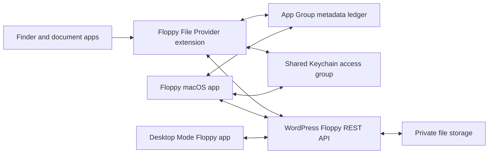

# Floppy macOS File Provider Sync Architecture

Floppy provides private-by-default WordPress file storage, a Desktop Mode app inside WordPress, and a native macOS sync surface in Finder. The macOS client should be implemented as a sandboxed container app plus a replicated File Provider extension. WordPress remains the source of truth for metadata, authorization, sharing state, and durable content storage.

This document defines the production architecture other implementation work should target.

## Goals

- Show each connected WordPress account as a Finder location without requiring full-disk access.
- Keep every file private until an owner explicitly grants access or creates a share.
- Sync metadata quickly and lazily hydrate file content only when Finder, Spotlight, or an app needs it.
- Preserve stable item identifiers across rename, move, content update, and device reinstall.
- Make conflicts recoverable and auditable instead of silently overwriting user data.
- Keep the Desktop Mode app and Finder sync clients on the same REST and authorization model.

## Non-goals

- Do not mount WordPress uploads or the media library directly.
- Do not expose public object URLs for private Floppy files.
- Do not implement a kernel filesystem extension, FUSE volume, or Finder Sync extension as the primary sync surface.
- Do not let the Desktop Mode app act as a background sync engine.

## Platform Choice

Use Apple's replicated File Provider API on macOS:

- The extension principal object adopts `NSFileProviderReplicatedExtension` and `NSFileProviderEnumerating`.
- The app registers one `NSFileProviderDomain` per connected WordPress site/account.
- Enumerators implement initial folder listing and working-set change listing.
- Local user changes are handled through `createItem`, `modifyItem`, `deleteItem`, and content fetch methods.
- Server-originated changes are surfaced by calling `NSFileProviderManager.signalEnumerator(for:)` from the app or extension after polling or push notification receipt.

Do not build on the legacy nonreplicated `NSFileProviderExtension` class for macOS.

## Component Map



## WordPress Server Responsibilities

The plugin owns the canonical state.

### Metadata Tables

Use dedicated tables instead of posts or attachments for private file state.

`wp_floppy_files` and `wp_floppy_folders`:

- `uuid`: stable file or folder UUID. Never derive it from a path.
- `site_id`: stable site UUID generated by Floppy.
- `owner_user_id`: WordPress user ID of the owner.
- `parent_id`: `0` for the account root.
- `kind`: represented by the table: `files` or `folders`.
- `name`: display filename.
- `normalized_name`: server-normalized sibling uniqueness key.
- `mime_type` and `content_type`: server-detected values.
- `size_bytes`: nullable for folders.
- `sha256`: content hash for files.
- `content_version`: monotonically increasing content version.
- `metadata_version`: monotonically increasing metadata version.
- `etag`: opaque version string returned to clients.
- `created_at`, `created_by`, `modified_at`, `modified_by`.
- `deleted_at`, `trashed_at`, `restored_at`.
- `storage_key`: private object key or private local path fragment.

`wp_floppy_sync_events`:

- `seq`: monotonically increasing integer per site.
- `target_type` and `target_id`.
- `parent_id`.
- `event_type`: `created`, `updated`, `moved`, `renamed`, `content`, `trashed`, `deleted`, `restored`, `permission`.
- `content_version` and `metadata_version` after the change.
- `actor_user_id`, `device_id`, `created_at`.
- `payload`: minimal JSON needed for conflict diagnostics.

`wp_floppy_acl_grants`:

- `id`, `target_type`, `target_id`, `principal_type`, `principal_ref`.
- `permission`: `read`, `write`, `owner`.
- Inherited sharing is represented by the parent folder grant unless a later table adds explicit inherited rows.
- `expires_at`, `revoked_at`, `created_by`.

`floppy_devices`:

- `device_id`, `user_id`, `site_id`.
- `display_name`, `platform`, `app_version`.
- `token_hash`, `last_seen_at`, `revoked_at`.
- Optional `push_token_hash` and push transport metadata.

### Storage

Store bytes outside the public media library path when possible. If the host only permits storage under `wp-content`, use a Floppy-private directory with server-level deny rules and still require authenticated PHP/REST streaming for every download. Webserver denies are a backstop, not the authorization layer.

Recommended storage key format:

```text
floppy/site-{site_uuid}/user-{owner_user_id}/{first_two_hash_chars}/{item_uuid}/{content_version}.blob
```

The storage key is not a public URL and must not be returned to clients.

## REST API Contract

Base namespace: `/wp-json/floppy/v1`.

All routes require authentication and an item-level authorization check. Desktop Mode calls use WordPress cookies plus `X-WP-Nonce`; macOS calls use a device-scoped token over HTTPS.

| Route | Method | Purpose |
| --- | --- | --- |
| `/discovery` | `GET` | Public service discovery for the WordPress site |
| `/health` | `GET` | Admin production diagnostics |
| `/devices` | `POST` | Register or rotate a macOS sync device |
| `/devices/{device_id}` | `DELETE` | Revoke a device and invalidate its token |
| `/files` | `GET` | Enumerate a folder by `parent_id`, `after_id`, `limit` |
| `/folders` | `POST` | Create a folder |
| `/files/{id}/rename` | `POST` | Rename with metadata-version compare-and-swap |
| `/files/{id}/move` | `POST` | Move with metadata-version compare-and-swap |
| `/files/{id}/trash` | `POST` | Trash a file |
| `/files/{id}/restore` | `POST` | Restore a file |
| `/files/{id}` | `DELETE` | Tombstone a file |
| `/files/{id}/download` | `GET` | Authenticated content download |
| `/files/{id}/preview` | `GET` | Authenticated inline preview |
| `/upload` | `POST` | Small-file upload |
| `/upload-sessions` | `POST` | Start resumable upload |
| `/upload-sessions/{uuid}/chunk` | `POST` | Append a chunk |
| `/upload-sessions/{uuid}/complete` | `POST` | Commit upload into a file version |
| `/sync/changes` | `GET` | Enumerate changes since an opaque sync anchor |
| `/conflicts` | `GET` | List unresolved conflicts for the current user/device |
| `/conflicts/{conflict_id}` | `POST` | Resolve by keep-local, keep-remote, duplicate, or rename |

Required response behavior:

- Return opaque cursors and anchors. Clients must not parse them.
- Include `uuid`, `parent_id`, `name`, `kind`, `size_bytes`, `mime_type`, `content_version`, `metadata_version`, capabilities, and timestamps for each item.
- Include tombstones in `/sync/changes` until every active sync anchor that could need them has expired.
- Return `409 Conflict` when the client's `If-Match` or base version is stale.
- Return `423 Locked` for intentional server-side locks.
- Return `404` only when the item is absent or invisible to the current user. Do not leak existence across grants.
- Return `410 Gone` or a typed Floppy error when a sync anchor is too old; the macOS extension maps this to `NSFileProviderError.Code.syncAnchorExpired`.

## Identifier Mapping

Stable identifiers are the heart of Finder sync.

| Concept | Format |
| --- | --- |
| Site UUID | Generated once by the plugin and exposed by `/discovery` or a future account endpoint |
| Device ID | Generated by the macOS app and registered with `/devices` |
| File Provider domain ID | `floppy:{site_uuid}:{user_id}` or a privacy-preserving hash of that tuple |
| File Provider item ID | `floppy:item:{item_uuid}` |
| Root | Map Apple's root container to the server account root |
| Working set | Map Apple's working set to `/sync/changes` |

Item identifiers must not contain filenames, hostnames, emails, or tokens. Display names belong in metadata only.

## Domain Lifecycle

The macOS app owns domain registration and account UI.

1. User signs in to a WordPress site using the app.
2. App validates HTTPS, Floppy API availability, account status, and device authorization.
3. App stores the device token in the shared Keychain access group.
4. App creates or updates a local App Group metadata ledger for the site/account.
5. App registers `NSFileProviderDomain` with a display name such as `Floppy - example.com`.
6. Finder shows the domain as a location.
7. On sign out, app revokes the device token and removes the domain. Prompt the user to remove all local data or preserve downloaded user data.

One WordPress user connected to two sites is two domains. Two WordPress users on the same site are two domains.

## Local Ledger

Use a small SQLite ledger in the App Group container shared by the app and extension.

Recommended tables:

- `accounts`: site UUID, base URL, user ID, domain ID, feature flags, current anchor.
- `items`: item ID, parent ID, name, versions, capabilities, last known server state.
- `pending_ops`: local create/update/delete operations waiting for upload.
- `materialized`: items currently known to have local content.
- `conflicts`: local and remote versions needing user resolution.
- `enumerators`: active folder or working-set enumerators for signal targeting.

The ledger is a cache plus retry queue. WordPress remains authoritative.

## Enumerators

### Folder Enumeration

For `enumerator(for:request:)` with a folder identifier:

1. Resolve the File Provider item ID to a server file or folder id plus kind.
2. Return an enumerator backed by `/files?parent_id={id}`.
3. Use server cursors as `NSFileProviderPage` values.
4. Cache returned metadata in the ledger.
5. Report folder items with capabilities derived from grants.

The root container enumerator lists the user's account root children.

### Working Set Enumeration

The working set should be intentionally smaller than the full tree. Include:

- Materialized items.
- Recent local edits and uploads.
- Recent remote changes affecting this user.
- Favorites or pinned items.
- Items with unresolved conflicts.

The working-set enumerator calls `/sync/changes?cursor={cursor}` and maps server sequence cursors to `NSFileProviderSyncAnchor`. If the server says an anchor expired, report `syncAnchorExpired` so the system can restart.

### Tombstones

Keep tombstones in `wp_floppy_tombstones` and related sync events long enough for offline Macs to observe deletes. A practical default is 90 days, plus a configurable extension for enterprise sites. If tombstones are pruned, expire older sync anchors and force reimport.

## Content Hydration

Files should be dataless until opened, previewed, indexed, or explicitly kept downloaded.

Fetch flow:

1. System asks the extension for content by item ID and optional version.
2. Extension requests `/files/{id}/download?version={content_version}`.
3. Server streams bytes only after authorization.
4. Extension writes to a temporary file, validates byte count and `sha256`, and returns the file URL and updated item metadata.
5. Ledger records the item as materialized.

Support HTTP range requests for large files and media previews. The server must check authorization before honoring any range.

## Local Changes

All user edits from Finder flow through File Provider extension callbacks and become REST writes.

### Create

- For folders, call `POST /folders` with parent, name, kind, and an idempotency key.
- For files, start an upload if content is present, commit it, then return the created item metadata.
- If a create is metadata-only first, return pending fields until content is committed.

### Modify

Map `modifyItem` changed fields to server operations:

- Rename: `POST /files/{id}/rename` with `name` and `metadata_version`.
- Move: `POST /files/{id}/move` with `parent_id` and `metadata_version`.
- Content replace: use `/upload` for small files or `/upload-sessions` for large files.
- Tags, favorite rank, and last-used date: store only if the product commits to syncing these. Otherwise report unsupported fields as still pending or ignore last-used updates intentionally.

Always include the server `etag` or version from the File Provider base version. Stale writes must return a conflict instead of overwriting.

### Delete and Trash

Finder delete should map to trash when the item capability allows trashing. Permanent delete is separate and should require owner permission. The server records tombstones for both.

### Progress and Cancellation

Every network-backed File Provider operation returns a `Progress` object and supports cancellation. Cancelled uploads remain resumable where possible and expire server-side after a short TTL.

## Conflict Policy

Conflicts are expected and should be boring.

Use optimistic concurrency:

- Each write includes the client's base `etag`.
- Server accepts only if the base still matches the item.
- If remote changed first, server returns `409 Conflict` with current remote metadata and conflict reason.

Default resolution:

- Content-content conflict: keep remote at original path and upload local as `filename (conflict from {device name} {date}).ext`.
- Rename-rename conflict: accept the first committed rename and surface the second as a conflict.
- Move-delete conflict: preserve local edit as a conflict copy under a `Recovered` folder unless the user chooses delete.
- Permission loss while editing: stop upload, mark local copy pending, and ask the user to export or request access.

The Desktop Mode app should expose the `/conflicts` queue. A macOS File Provider UI extension can be added later for native conflict/auth prompts.

## Change Signaling

Server-originated changes need a signal path back to macOS.

Recommended phases:

1. MVP polling: macOS app periodically calls `/sync/changes` for each connected domain and then calls `signalEnumerator(for: .workingSet)` when changes exist.
2. Active folder hints: extension records active folder enumerators in the ledger; app can signal those folders after polling.
3. Push: add PushKit file provider pushes when the app has Apple developer entitlements and server APNs support. For replicated extensions, send working-set notifications and let the system propagate UI updates.

Do not send a push for every byte uploaded. Coalesce by domain and sequence range.

## Desktop Mode App Boundary

The Desktop Mode app is the WordPress-native file manager and conflict console.

Implementation expectations:

- Register the app/window through Desktop Mode public APIs, such as `desktop_mode_register_window()` for PHP windows or `wp.desktop.registerWindow()` for JS windows.
- Open Floppy with `wp.desktop.openWindow(id, { source })`.
- Use `wp.desktop.HOOKS` and `wp.hooks` for file drop, window lifecycle, dock/icon decoration, and badges.
- Use Floppy REST endpoints for all file data.
- Use WordPress REST nonces for cookie-authenticated requests.
- Keep Desktop Mode state in Desktop Mode storage APIs where applicable. Do not read private Desktop Mode localStorage keys or scrape window DOM.

Desktop Mode can upload files, browse private files, manage shares, resolve conflicts, and show sync/device status. It should not store macOS device tokens or run background Finder sync logic.

## Error Mapping

| Server condition | HTTP/Floppy error | File Provider behavior |
| --- | --- | --- |
| Not signed in or token revoked | `401` | `notAuthenticated`; app prompts reauth |
| Token valid, item denied | `403` or hidden `404` | no item or read-only capabilities |
| Item missing for this user | `404` | `noSuchItem`; system removes stale local item |
| Anchor expired | `410` / `anchor_expired` | `syncAnchorExpired`; reimport |
| Server offline | `503` | `serverUnreachable`; retry |
| Quota exceeded | `507` / `quota_exceeded` | keep pending, surface user action |
| Stale base version | `409` / `conflict` | create conflict record |
| Invalid filename | `400` / `invalid_name` | reject operation with user-visible error |

## Observability

Log enough to debug sync without leaking content:

- Correlation ID per REST request and File Provider operation.
- Domain ID hash, device ID hash, item ID, sequence, operation type.
- Bytes transferred, duration, retry count, HTTP status.
- Conflict creation and resolution decisions.

Do not log file contents, tokens, raw Authorization headers, or full local paths. Filenames should be redacted by default and enabled only in explicit debug mode.

## Test Plan

Server:

- Unit tests for grant resolution, path normalization, conflict detection, tombstones, and anchor expiry.
- REST tests for every route with owner, shared reader, shared writer, revoked user, and anonymous user.
- Large upload tests with chunk retry, checksum mismatch, and quota failure.

macOS:

- Unit tests for identifier mapping, anchor encode/decode, and REST error mapping.
- Integration tests with a local WordPress test site and fake network failures.
- Finder smoke tests: add domain, enumerate root, create folder, upload file, rename, move, delete, restore, offline edit, reconnect conflict.
- Uninstall/sign-out tests for both remove-all and preserve-downloaded-data domain removal choices.

Desktop Mode:

- Window registration and open behavior through public Desktop Mode APIs.
- Drag/drop upload with nonce and capability checks.
- Conflict queue rendering and resolution.
- No private Desktop Mode key or DOM probing.

## Rollout Plan

1. Build server metadata, storage, REST, and Desktop Mode browser first.
2. Ship internal macOS app with polling-only File Provider sync.
3. Add resumable upload, conflict UI, and robust offline retry.
4. Add push signaling after the sync model is stable.
5. Consider native File Provider UI extension for account and conflict prompts after real-world conflict data exists.

## References

- Apple File Provider sample: <https://developer.apple.com/documentation/FileProvider/synchronizing-files-using-file-provider-extensions>
- Apple `NSFileProviderReplicatedExtension`: <https://developer.apple.com/documentation/fileprovider/nsfileproviderreplicatedextension>
- Apple File Provider push signaling: <https://developer.apple.com/documentation/fileprovider/using-push-notifications-to-signal-changes>
- Apple App Groups entitlement: <https://developer.apple.com/documentation/BundleResources/Entitlements/com.apple.security.application-groups>
- WordPress REST API authentication: <https://developer.wordpress.org/rest-api/using-the-rest-api/authentication/>
- WordPress custom REST endpoints: <https://developer.wordpress.org/rest-api/extending-the-rest-api/adding-custom-endpoints/>
